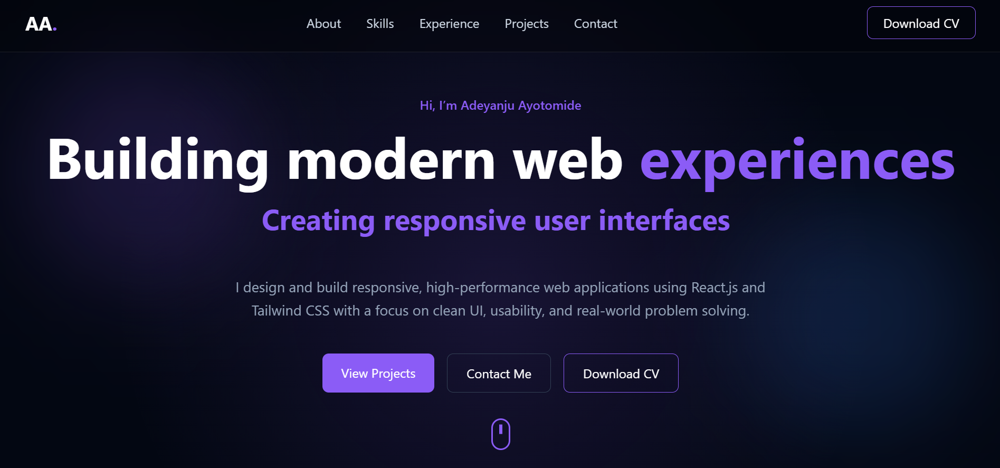

#  Portfolio - Adeyanju Ayotomide

My personal developer portfolio built with React.js and Tailwind CSS.  
It showcases my skills, projects, and experience as a Frontend Developer.

---

## 🔗 Live Website
https://ayotomide-portfolio.vercel.app

---

## 👨‍💻 About Me

I’m **Adeyanju Ayotomide**, a Frontend Developer based in Nigeria.  
I specialize in building modern, responsive, and user-friendly web applications using **React.js** and **Tailwind CSS**.

I enjoy turning ideas into clean, scalable, and production-ready interfaces.

---

## 🧰 Tech Stack

- React.js
- JavaScript (ES6+)
- Tailwind CSS
- Framer Motion
- React Router
- Git & GitHub

---

## 📁 Featured Projects

### 🎨 BHD Auctions – Digital Art Auction Platform
A modern web platform for real-time art discovery and bidding.

- Live: https://bhd-auctions.vercel.app/
- GitHub: https://github.com/teecodes-dev/bhd-auctions

---

### 👕 Two47 Store – Streetwear E-commerce Platform
A fashion-focused e-commerce platform built for identity-driven shopping.

- Live: https://two47-store.vercel.app/
- GitHub: https://github.com/teecodes-dev/two47-store

---

## 📸 Portfolio Preview

> Add a screenshot of your portfolio below

---

## 📬 Contact Me

- Email: ayotomideadeyanju@gmail.com  
- WhatsApp: https://wa.me/2348061520324  
- GitHub: https://github.com/teecodes-dev  
- LinkedIn: https://ng.linkedin.com/in/adeyanju-ayotomide  
- Twitter/X: https://x.com/Haryor449022  

---

## 📌 Purpose

This portfolio is built to showcase my frontend development skills, projects, and readiness for internship or junior developer roles.

---
Updated deployment test